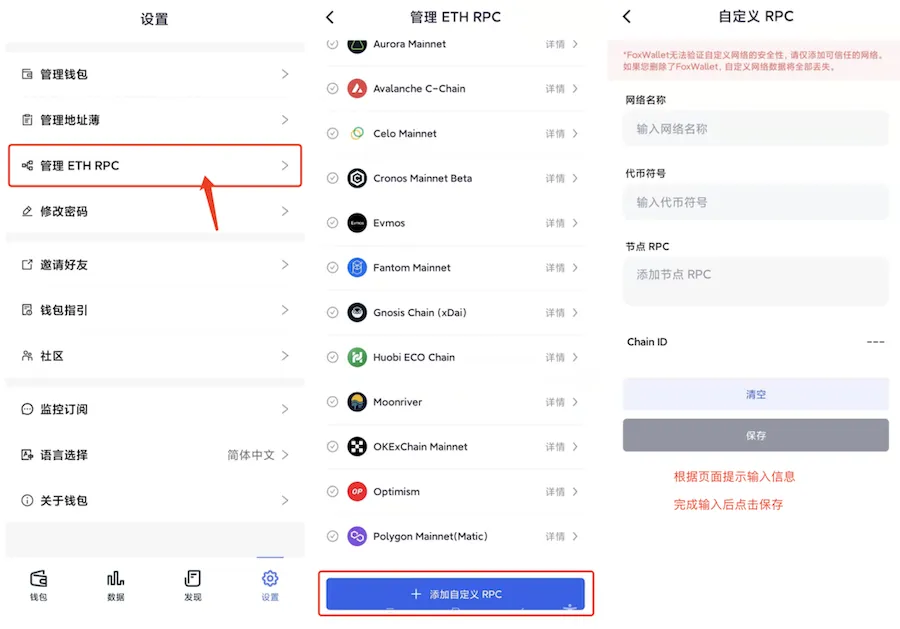

# 添加自定义RPC
FoxWallet 已内置以下以太坊兼容链：[BNB Chain](./bsc.md), [Arbitrum](./arbitrum.md), [Aurora](./aurora.md), [Avalanche](./avalanche.md), [Boba](./boba.md), [Celo](./celo.md), [Cronos](./cronos.md), [Evmos](./evmos.md), [Fantom](./fantom.md), [Gnosis](./gnosis.md), [HECO](./heco.md), [KCC](./kcc.md), [Moonbeam](./moonbeam.md), [Moonriver](./moonriver.md), [OKC](./okc.md), [Optimism](./optimism.md), [Polygon](./polygon.md), [zkSync 2.0 alpha testnet](./zksync-v2-alpha-testnet.md). 。 

使用这些链只需在设置中开启，无需手动添加自定义RPC。

如果你想要交互的链不在上述列表中，可以手动进行添加："设置" => "管理 ETH RPC" => 填写信息并保存。

添加完成后可在钱包首页点击左上角的切换按钮进行切换。