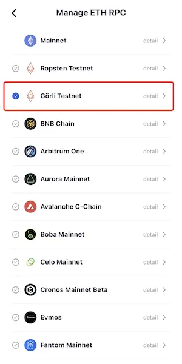
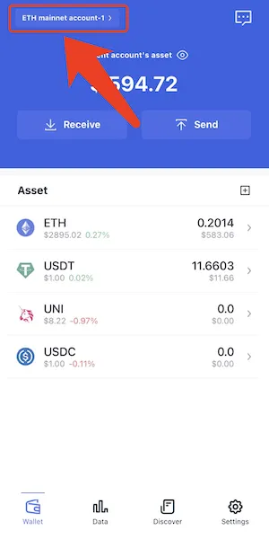

# 以太坊测试网 Goerli (Görli)

## 添加网络
打开FoxWallet，进入设置页 => "管理 ETH RPC" => 勾选 Goerli Testnet => 返回到钱包主页。

## 切换网络
点击左上角的切换按钮 => 选择 Goerli Testnet => 选择一个账户。

## 获取测试币
Goerli测试币可通过一下水龙头领取：
* https://faucet.goerli.mudit.blog/
* https://goerli-faucet.slock.it/
* ​https://faucets.chain.link/goerli
* ​https://faucet.paradigm.xyz/
* https://goerlifaucet.com/
* https://fauceth.komputing.org/?chain=5