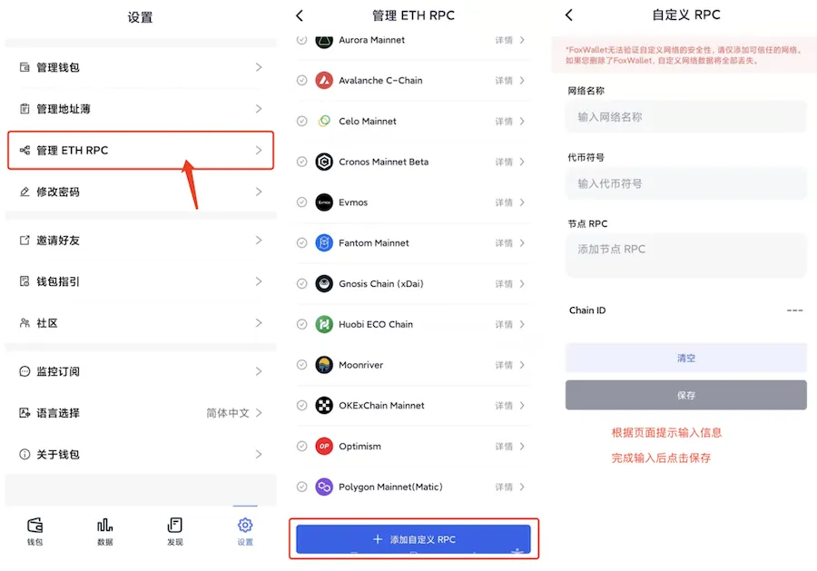
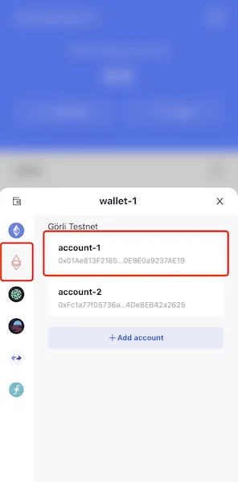

# 以太坊测试网 Goerli (Görli)

## 添加网络
打开FoxWallet，进入设置页 => "管理 ETH RPC" => 填写以下信息并保存。

* 网络名称：`Goerli`
* 代币符号：`GOR`
* 节点RPC：`https://rpc.goerli.mudit.blog`

## 切换网络
返回到钱包主页面，点击左上角的切换按钮, 并选择要使用的账户。

## 获取测试币
Goerli测试币可通过一下水龙头领取：
* https://faucet.goerli.mudit.blog/
* https://goerli-faucet.slock.it/
* ​https://faucets.chain.link/goerli
* ​https://faucet.paradigm.xyz/
* https://goerlifaucet.com/
* https://fauceth.komputing.org/?chain=5