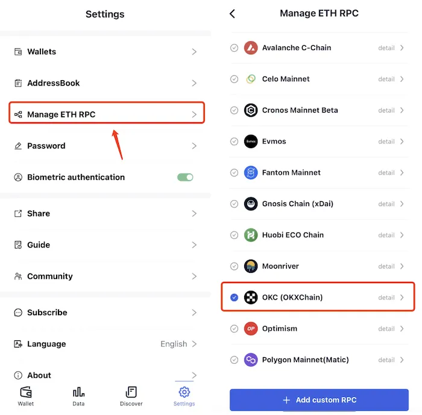
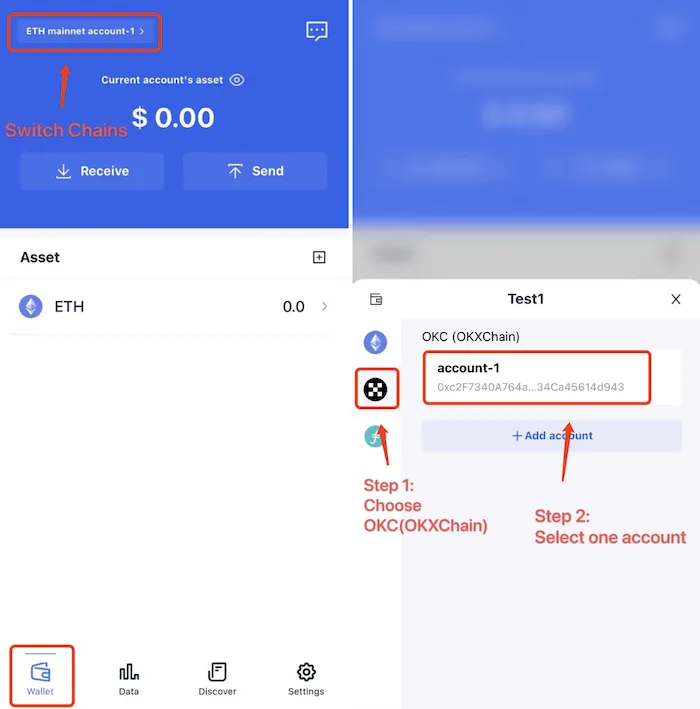

# OKC (OKXChain)

[FoxWallet](https://foxwallet.com)是最好用的OKC钱包，OKXChain钱包，OKExChain钱包，OKT钱包，OK链钱包。

## 添加 OKC (OKXChain)

“设置” => “管理 ETH RPC” => 勾选 OKC (OKXChain) => 返回到钱包主页。

## 切换至 OKC (OKXChain)

点击钱包主页左上角的切换按钮 => 选择 OKC (OKXChain) => 选择一个账户。

