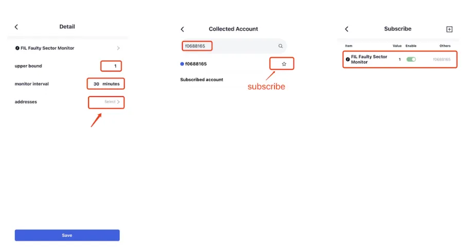
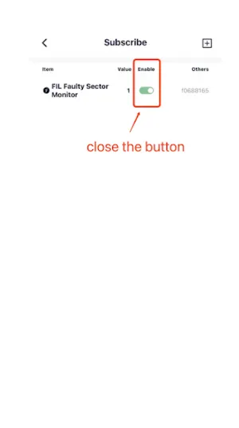

# 错误扇区监控
错误扇区监控功能可用于监控任意节点的掉算力情况，即使该节点不属于自己也可以监控。

订阅后 FoxWallet 服务器将定时检查节点的错误扇区数，一旦超过设定的阈值就会将报警消息推送到手机（推荐使用iOS，推送比较稳定）。

点击“设置”，选择“监控订阅”，点击页面右上方的“+”，选择“错误扇区数”。

进入“设置错误扇区监控”的详情页，根据实际需求设置“监控阈值”和“监控间隔”（通常使用默认参数即可），并且点击“监控地址”，在搜索栏中搜索需要监控的账户，返回上一页，点击“保存”即订阅成功。

此功能还支持一次性监控多个矿工号。

当 FoxWallet 检测到该矿工的错误扇区数大于“监控阈值”，报警通知会推送到用户的手机上。

## 如何关闭错误扇区监控功能
若想关闭已开启节点的错误扇区监控功能，在”监控订阅“界面关闭相应节点的“生效”按钮即可。

