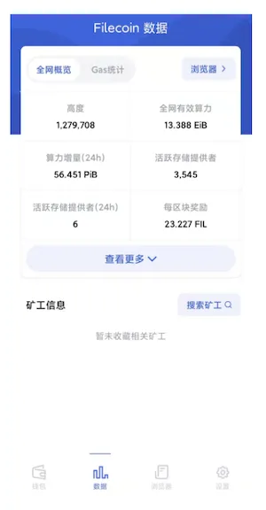
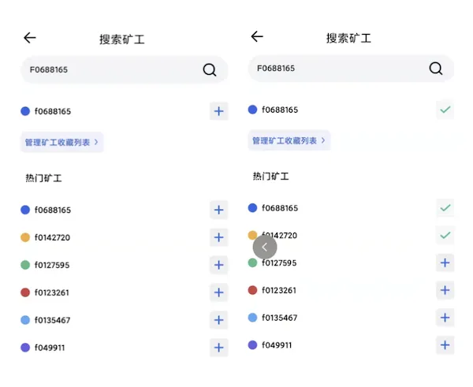
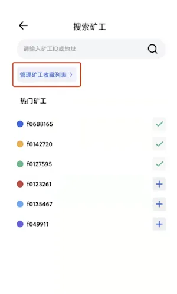

# 矿工信息订阅

点击底部 “数据” 导航栏，进入 Filecoin 链上数据页。

## 添加订阅
点击 “搜索矿工” 按钮进入页面，根据页面显示，输入 矿工ID 或 地址 进行搜索。

根据搜索结果，点击右边对应“+”号，即订阅成功。

退回至“数据”页面，即可看到该节点的相关信息。

## 取消订阅

点击“搜索矿工”按钮进入页面，选择“管理矿工收藏列表”进入列表管理页面。

点击节点号右边对应的“-”号，即可取消关注。

