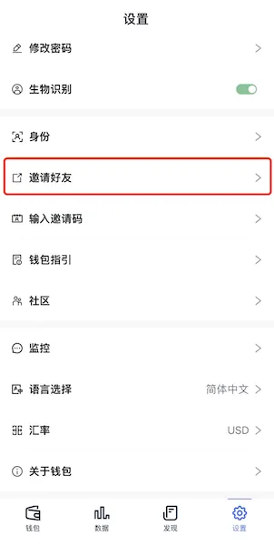
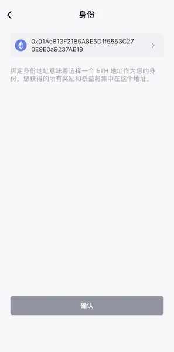
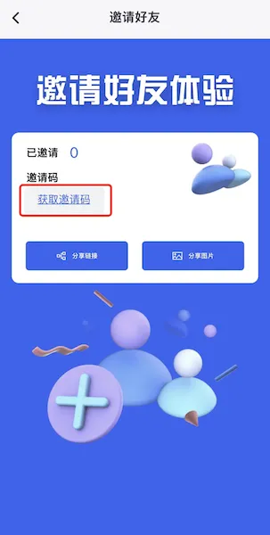
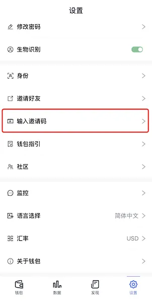

# 邀请
邀请朋友[下载FoxWallet](https://foxwallet.com/download)，并填写邀请码。

## 1. 获取自己的邀请码

* 点击“设置”页中的“邀请好友”菜单进入邀请页
  
  
* 如果还未绑定身份ID，需要先点击“需要先绑定身份”，选择一个以太坊账户作为你的身份地址
  
  
* 在邀请页点击“获取邀请码”，通过验证后即可得到自己的邀请码
  
  

## 2. 邀请朋友下载FoxWallet

* 在邀请页点击“分享链接” 或者 “分享图片”，把 FoxWallet 的下载方式分享给朋友
* 也可以直接发送 FoxWallet 的官网地址：`https://foxwallet.com/`

## 3. 让朋友填写邀请码

* 复制并发送第一步中得到的邀请码给朋友
* 让朋友进入设置页，点击“输入邀请码”菜单
  
  
* 填写邀请码同样需要绑定身份ID，点击“需要先绑定身份”，选择一个以太坊账户作为身份地址
* 填写邀请码
  
  