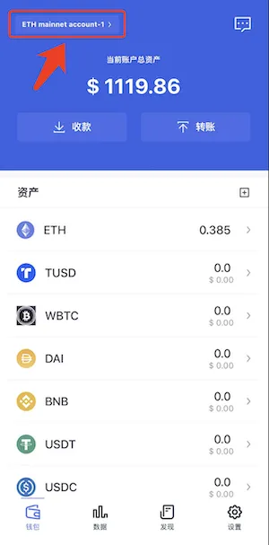
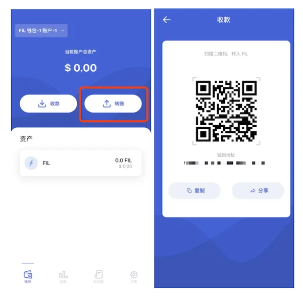
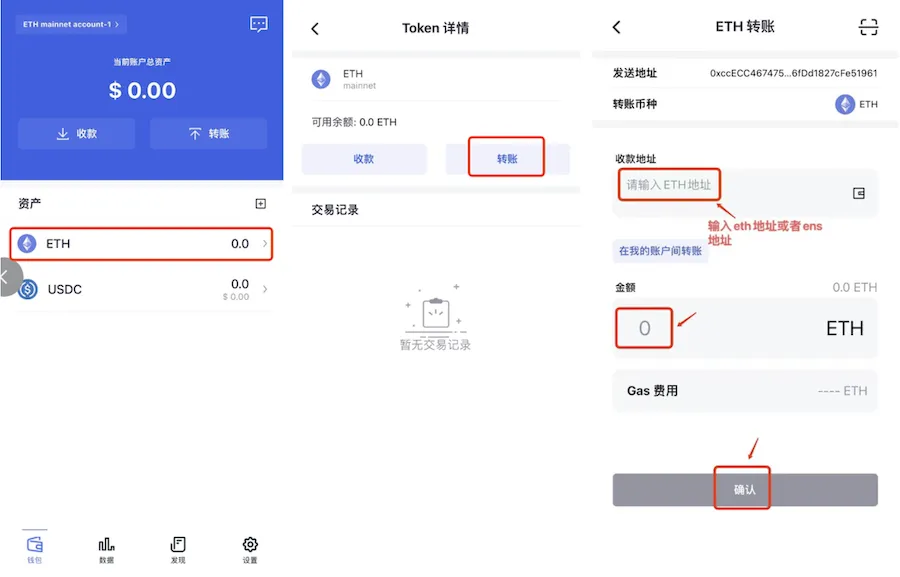
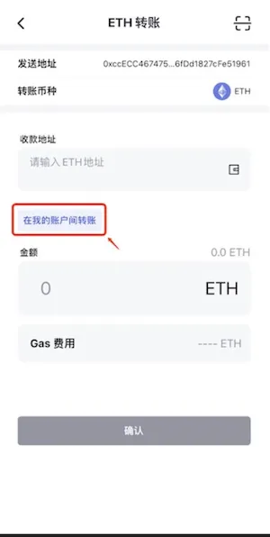

# 收款与转账
FoxWallet 支持多种链，可点击 ”钱包“页面左上角按钮进行切换。

### 收款
点击”收款”按钮，可获取钱包地址和二维码。

### 转账

钱包首页点击需要转账的币种 => 点击“转账” => 输入收款地址和对应金额 => 点击确认转账。

此外，FoxWallet 还提供了在钱包账户之间转账的便捷功能。

### 交易记录
在资产列表点击资产进入资产详情页，可查看历史交易记录和详情。

