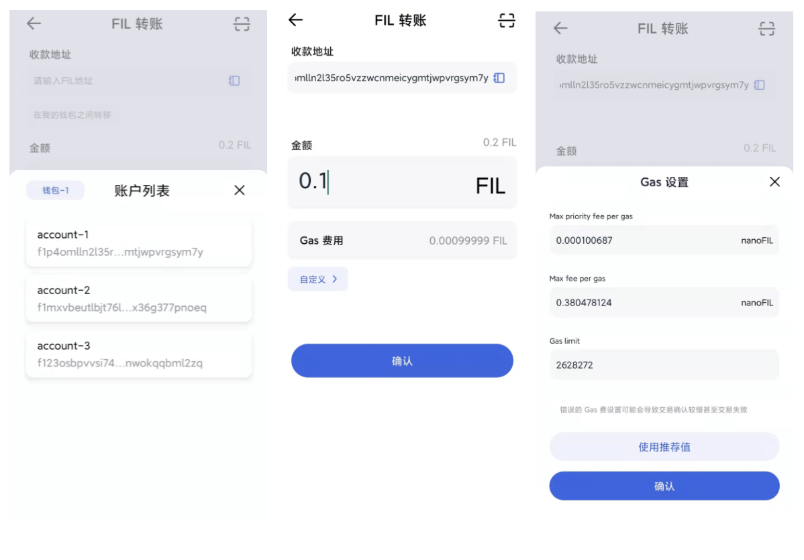
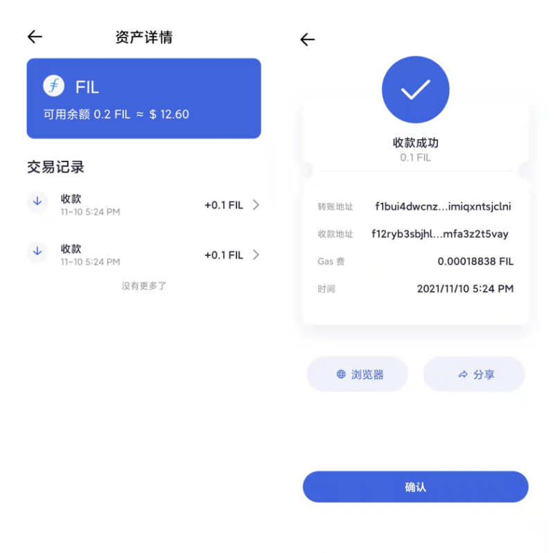

# 收款与转账
FoxWallet 支持多种链，可点击 ”钱包“页面左上角按钮进行切换。

### 收款
点击”收款”按钮，可获取钱包地址和二维码。

### 转账
转账功能适用于 FoxWallet 各钱包账户之间转账 以及 钱包外地址转账。

若为钱包外地址，直接粘贴地址至对应输入框或扫描收款地址二维码，进行转账操作。

若为钱包内地址，在收款地址输入框下方“在我的钱包之间转移”选择对应地址即可。

FoxWallet 会对 Gas费进行预估并自动填充，用户也可以使用“自定义”功能进行手动调整。

### 交易记录
在资产列表点击资产进入资产详情页，可查看历史交易记录和详情。

