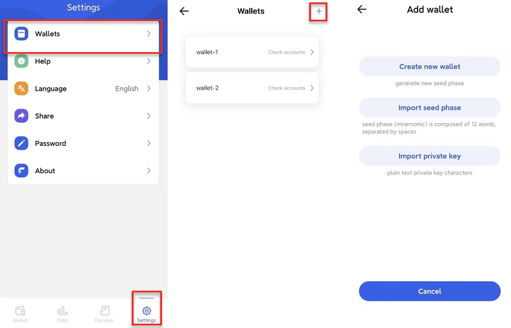
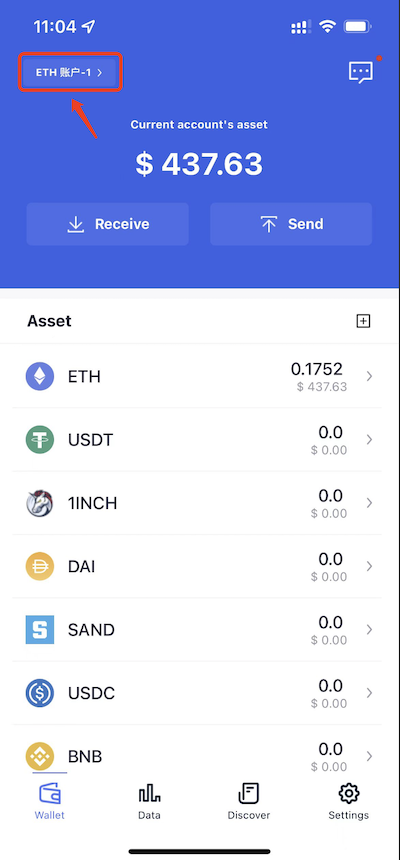
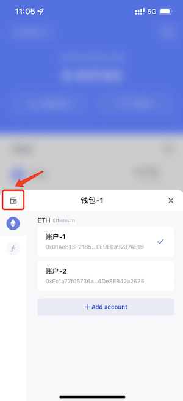
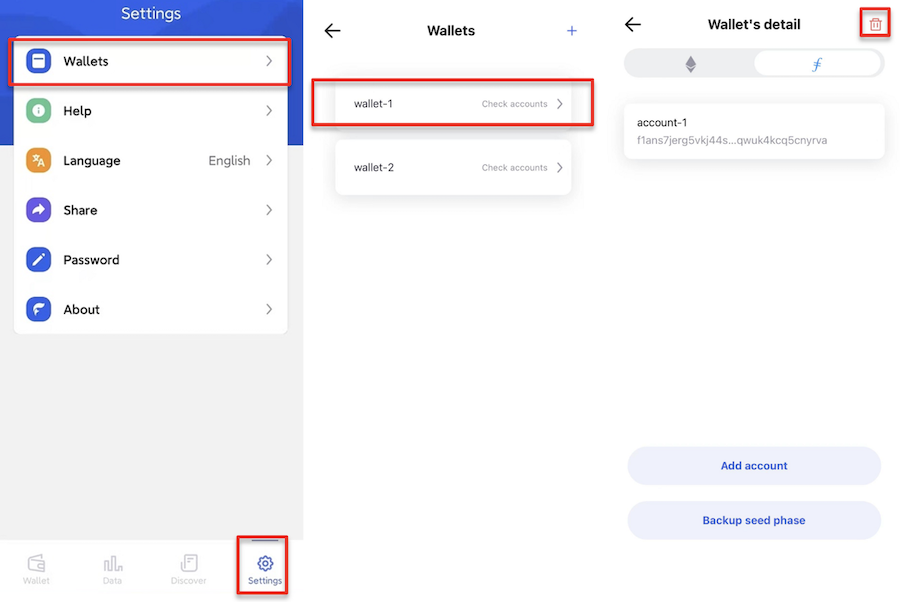
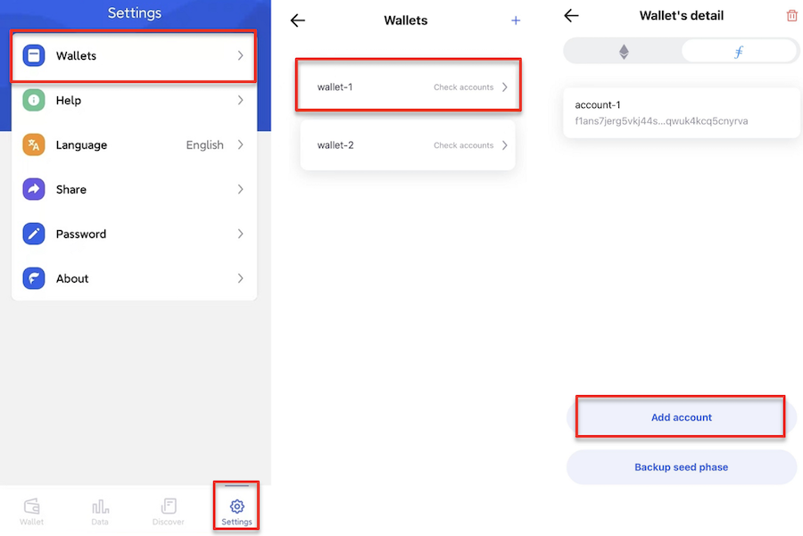

# 管理钱包
FoxWallet 支持通过私钥或助记词的方式导入多个钱包，助记词类型的钱包根据 [BIP44协议标准](https://github.com/bitcoin/bips/blob/master/bip-0044.mediawiki) 可派生多个账户，每个账户对应唯一地址。

通过 “设置页” => "管理钱包" 就可以进到“管理钱包”页面，用户可以查看、添加、删除 钱包及每个钱包下的账户。

## 添加钱包
在 “管理钱包” 页点击 “添加钱包” 按钮即进入添加钱包流程，可以选择 “创建钱包”、“导入助记词”、“导入私钥” 三种方式。

其中 “创建钱包” 会通过安全的随机算法新生成一套助记词，“导入助记词“ 支持导入其他钱包生成的12位或24位助记词，“导入私钥” 则和特定的链相关。

## 切换钱包
点击钱包页左上角的切换按钮。 
  

点击弹窗左上角的管理图标。  
  

选择你要切换的钱包。 
  

返回上级页面，已经切换到新钱包了。 
  

## 删除钱包
在“钱包详情”页，点击右上角的“...”按钮，在弹出的功能框里就有“删除钱包”的选项。需要注意删除钱包后唯一能恢复钱包的办法就是通过你自己事先备份好的助记词，否则神仙也帮不了。

## 添加账户
选择钱包进入 “钱包详情” 页面，然后点击 “添加账户” 的按钮就可以派生新账户了。注意：只有助记词钱包才支持派生多账户，私钥钱包是只有一个账户不可新增的。

